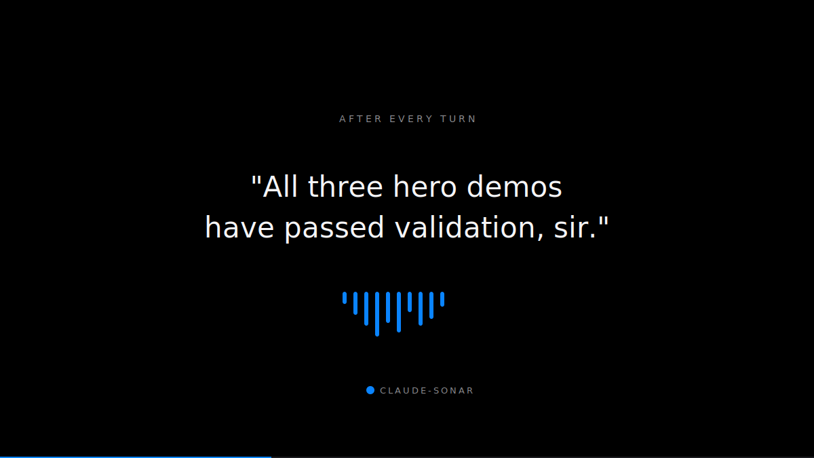
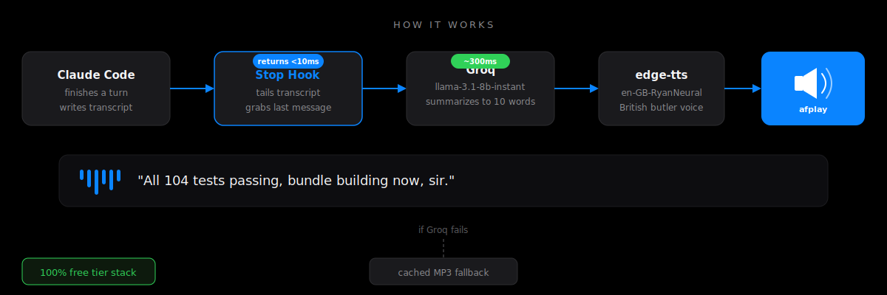
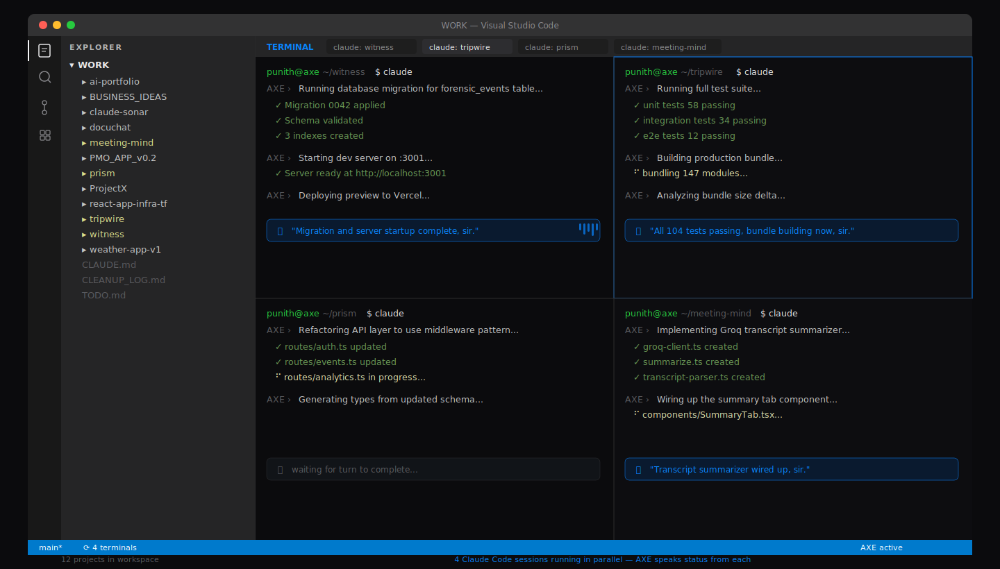

# claude-sonar

### [Solved] The observability gap in parallel AI agent workflows — hear what every Claude Code session just did, without looking.

I run 12+ projects and 8+ terminals at the same time. My AI assistant **AXE — Automated X-platform Engine** — speaks a contextual status line after every turn, so I know which workflow just finished without alt-tabbing.




---

## Why this exists

Visual attention is single-threaded. You can't watch eight terminals at once. So you end up anxiously switching between them — checking, rechecking, context-switching — just to see if something finished or broke. That overhead eats the productivity you're supposed to be getting from parallel delegation.

With `claude-sonar`, you stop monitoring. You only check a terminal when AXE tells you it needs your attention. The rest of the time? You're reading docs, reviewing a PR, sketching architecture, or just thinking — outside the IDE, doing the work that actually needs a human.

`claude-sonar` wires into **4 Claude Code hook events** — Stop, PermissionRequest, SubagentStop, and Notification. Every pause point, every event, every session:

1. Detects **which project** the session is working on (from cwd, file paths, or transcript)
2. Grabs the last assistant message — text or tool actions
3. Sends it to Groq `llama-3.1-8b-instant` (~300ms, free tier) with the project name injected
4. AXE speaks a contextual line naming the project via `edge-tts` `en-GB-RyanNeural`
5. Hook returns in <10ms — Claude never blocks

**AXE speaks on every event:**

| Event | When it fires | Chime |
|-------|---------------|-------|
| **Stop** | Turn complete (success or fail) | Glass.aiff |
| **PermissionRequest** | Needs your approval | Ping.aiff |
| **SubagentStop** | Parallel agent finished | Submarine.aiff |
| **Notification** | System notification | — |




Every line above is real, pulled straight from `voice.log`. None are scripted — each is generated fresh from what Claude actually just said.



---

## Key features

- 🎯 **Project-aware voice** — every line names the project: *"Build successful for Witness, sir."* / *"Two test failures on Tripwire, sir."*
- 🗣️ **Pick how AXE addresses you** — installer asks at setup: **Sir**, **Mam** (British short form), or **Neutral** (no honorific). Stored as `AXE_ADDRESS` in `~/.claude/hooks/.env`; flip anytime with one edit.
- 📡 **All events covered** — Stop, PermissionRequest, SubagentStop, Notification. AXE speaks on every pause, not just turn completion.
- 🔧 **Tool-only turns included** — even if Claude only ran Edit/Bash/Write with no text reply, AXE still speaks about what tools were used.
- ⚡ **Sub-10ms hook** — fully async. Claude never waits on voice.
- 🧠 **Groq `llama-3.1-8b-instant`** — ~300ms round-trip, free tier (30 req/min).
- 🇬🇧 **British butler voice** — `en-GB-RyanNeural`, A/B tested against 4 alternatives.
- 🛟 **Graceful degradation** — cached MP3 fallbacks if the LLM call fails.
- 💸 **Free to run** — no paid APIs, no local models, no build step.
- 🔧 **Swap anything** — voice, model, callsign, persona — all one-line edits.

## Requirements

- macOS (uses `afplay`)
- Python 3.10+
- `jq`, `curl` → `brew install jq curl`
- Free Groq API key → [console.groq.com/keys](https://console.groq.com/keys)

## Install

```bash
git clone https://github.com/ipunithgowda/claude-sonar.git
cd claude-sonar
./install.sh
```

The installer will ask how AXE should address you — **Sir**, **Mam** (British short form — the TTS voice renders it cleanly, whereas "ma'am" gets swallowed), or **Neutral** (no honorific). You can change this later by editing `AXE_ADDRESS=` in `~/.claude/hooks/.env`.

Then:

1. Paste your Groq key into `~/.claude/hooks/.env`
2. Merge all 4 hook blocks (Stop, PermissionRequest, SubagentStop, Notification) from `settings.json.example` into `~/.claude/settings.json`
3. Open a new Claude Code session — first reply will chime and speak with your project name

**Setup time: under 3 minutes.**

## Configure

Edit `~/.claude/hooks/axe-voice.sh`:

| Variable | Default | Swap to |
|----------|---------|---------|
| `EDGE_VOICE` | `en-GB-RyanNeural` | `python3 -m edge_tts --list-voices` for options |
| `GROQ_MODEL` | `llama-3.1-8b-instant` | `llama-3.3-70b-versatile` for smarter (slower) lines |

Drop `CLAUDE.md.example` into `~/.claude/CLAUDE.md` to make the written tone match the voice.

## Files

| Path | Purpose |
|------|---------|
| `hooks/axe-voice.sh` | The voice hook — detects project, tails transcript, calls Groq, speaks via edge-tts. Wired into all 4 events. |
| `hooks/.env.example` | Template for `GROQ_API_KEY` |
| `hooks/voice-cache/` | Fallback MP3s if the LLM call fails |
| `settings.json.example` | All 4 hook event wirings for `~/.claude/settings.json` |
| `CLAUDE.md.example` | AXE persona prompt for the text layer |
| `install.sh` | One-shot installer |
| `assets/ad.html` | Apple-ad animation (22s loop, screen-record ready) |
| `screenshots/` | Visual assets for this README |

## Troubleshooting

Tail `~/.claude/hooks/voice.log` — every invocation logs there.

- **Silent** → missing `GROQ_API_KEY`, `jq`, `edge-tts`, or wrong `PYTHON_BIN`
- **Voice spells letters** → write callsigns as single words (`AXE` not `A.X.E.`)
- **Generic lines only** → Groq call failing; check `voice.log` for HTTP errors

*AXE — Automated X-platform Engine.* The assistant callsign.

---

Built by [Punith Gowda](https://github.com/ipunithgowda)
